# Hi there 👋, I'm Minh
🚀 As an Artificial Intelligence Engineer at WeGOMKT, I focus on architecting and deploying scalable AI solutions to optimize marketing automation and enable data-driven decision-making. My work involves designing AI workflows, developing and fine-tuning Large Language Models (LLMs), and implementing Retrieval-Augmented Generation (RAG) systems to enhance specialized content generation
And also a Passionate Fullstack Developer in the making — specialized in crafting smooth Frontend experiences with React/Next.js, and currently diving deeper into scalable Backend systems with Node.js & microservices.

  

- 💬 Ask me about **everything you need**

- 📫 How to reach me **elevenine00@gmail.com**

## Skill stack

**Also comfortable with**: SQL (BigQuery, Postgres, Mongo, etc), CI/CD pipelines, Networking and Security (VPC, IAM), Vector Databases, Cloud Infrastructure (AWS/GCP), Data Pipelines, Monitoring & Observability, Prompt Engineering, MLOps workflows.

---

## Projects - showcase

**`I’m still polishing this section ✨ but u can always take a peek at my repo — that’s where the fun stuff lives.`**

---
## Stats

  
  

---
<h3 align="left">More contact ?</h3>
<a href="https://bento.me/himn" target="_blank" rel="noopener noreferrer">Click here</a>
